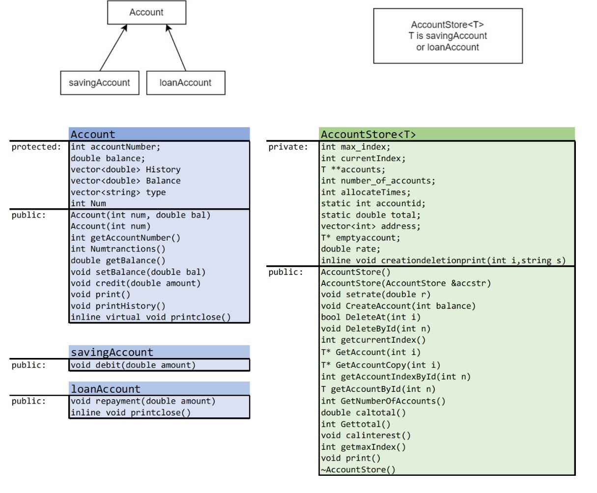
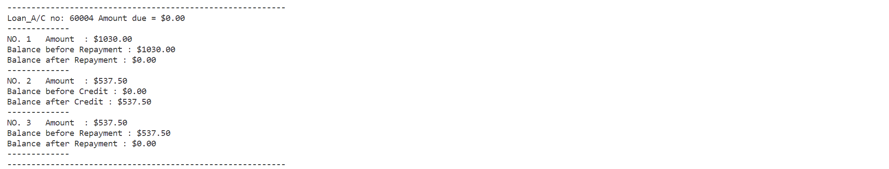
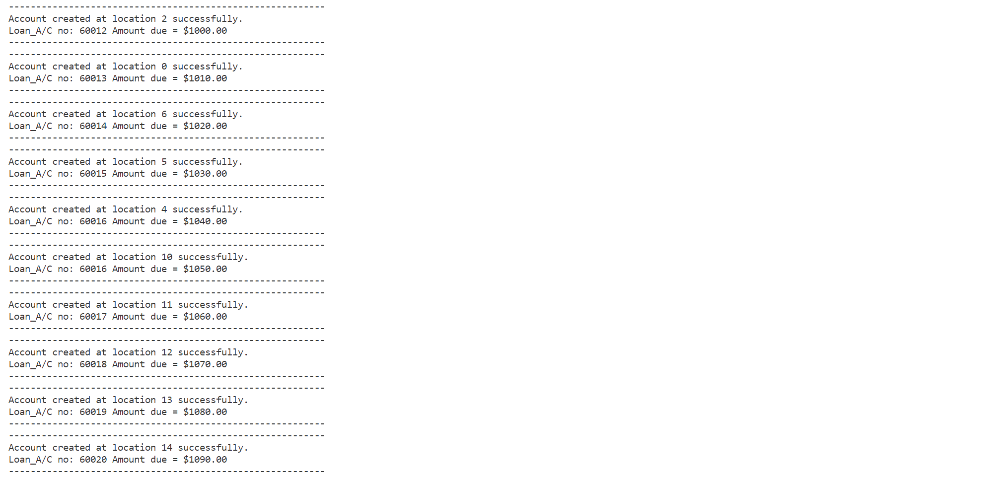

# Report

## Introduction

Bank account systems play an integral part in our daily lives. It helps banks to manage customers’ accounts, e.g., recording deposits and withdrawals, and calculating interests for deposits and loans. It also helps customers to process borrowing requests and repayments. At present, nearly all financial institutions have their own electronic digital bank account systems that process transactions with speed and accuracy. This project aims to bring a Bank account system that allows the handling of deposits, withdrawals, loans, interest calculation, balance calculation, and account management alive.

## Approach
A real-world bank account system consists of numerous functions and commands. In addition, many banks offer online banking platforms. Some banks also work with mobile phone applications to provide mobile payment, such as Alipay, and Apple Pay. In this project, several key features of real-world account systems are extracted and implemented through an objected-oriented programming paradigm.

The system is realized in a two-level implementation. The base level is basic account manipulation of savings accounts and loan accounts. The second level is account system management.

The structure of the program is shown below.




### Program structure
#### On the account level, the following functions of the program are implemented:
1.	Account initialization with the account number and with or without balance
2.	Display of account information (account number and current balance)
3.	Display of credit/debit history for savings account
4.	Display of credit/repayment history of loan account
5.	Credit and debit for savings account
6.	Credit and repayment for loan account

#### On the system management level, the following functions of the program are implemented:
1.	System initialization
2.	System backup
3.	Set system interest rate
4.	Creation and deletion of account at any time
5.	Calculate the interest of all accounts in the system
6.	Search account information by account number
7.	Get the specific account
8.	Get the total amount saved/owed to the bank
9.	Get the total number of active accounts in the system
10.	 Display all the account information


The system management  applies  to both savings accounts and loan accounts. In this project, the base level is implemented through `savingAccount` and `loanAccount` classes. The second level is implemented through the template class `AccountStore`.

## Solution
Detailed implementations of the bank account system can be found in `Account.h` (account level) and `AccountStore.h` (system management level), `tests.h` included some test functions, `Source.cpp` included the main function and all the header files to test and use the program.

### Key elements of the program

#### Data hiding
* One advantage of objected-oriented programming is the use of private or protected class members for data hiding.

```c++
template <class T>
class AccountStore {
private:
	//private members allows data hiding
	int max_index; //record the current allocated memory, the value increases due to need
	...
	double rate; //rate for interest calculation
	inline void creationdeletionprint(int i,string s){...}
```

#### Information display
* The infomation is displayed in various formats. Some are shown below.

##### Account history display


##### Notice display


##### Warning display


##### Account creation in account system display 


##### Account deletion in account system display 


##### Active accounts in account system display


#### Recording of debit/repayment and credit

* Before performing the transaction, the amount of debit/repayment and credit is checked to ensure valid input.

* Transaction history is recorded using `vector<int>` to allow expansion of recording size and ease of accessing vector elements during printing.

```c++
void credit(double amount) {
        if (accountNumber != 0) {
		if (amount <= 0) {
			cout << "---NOTICE!---" << endl;
			cout << "Can't credit a non-positive amount.\n";
			cout << "-------------" << endl;
			return;
		}
		else {
			//record transaction
			balance = balance + amount;
			History.push_back(amount);
			Balance.push_back(balance);
			type.push_back("Credit");
			Num++;
		}
	}
}
```

#### Handling of invalid access
* In many instances, the access request of an invalid account (an account that is not present in `accounts` array) will arise in getter functions in `AccontStore` class. In addition, those getter functions are often followed by manipulation functions on `Account` class. To avoid runtime errors, an empty account with account number 0 is returned in those getter functions, e.g., `GetAccount()`, `getAccountById()`.

```c++
T* GetAccount(int i) {
	if (i <= max_index && accounts[i] != NULL) {
		return accounts[i];
	}
	else {
		cout << "---WARNING!---" << endl;
		cout << "Invalid access, no active account at index " << i << ", empty account will be returned" << endl;
		cout << "--------------" << endl;
		emptyaccount = new T(0, 0);
		return emptyaccount;
	}
}
```

* As such, in `Account` class, all manipulations are done on accounts with non-zero account numbers. Warnings are printed for invalid access of accounts with account number 0.

```c++
int getAccountNumber() const {
	if (accountNumber != 0) {
		//accountNumber = 0  refers to the empty account that is created due to error handling of invalid access, 
		//this empty account is not a valid account for manipulation
		return accountNumber;
	}else{
		cout << "---WARNING!---" << endl;
		cout << "Requested account is not valid, -1 returned." << endl;
		cout << "--------------" << endl;
	        return -1;
	}		
}
```

#### Calculate interest
* A key element of bank accounts is calculating interest. This is implemented as a credit to the original account.

```c++
void calinterest() {
	for (int i = 0; i < currentIndex; i++) {
		if (accounts[i] != NULL) {
			accounts[i]->credit(accounts[i]->getBalance() * rate);
		}
	}
}
```


### Optimizations used in the program

Several optimizations are used in this project to aid speed and memory allocation. They are listed below.

#### 1.	Pointers use in Account storage

In AccountStore class, each member in accounts is of type `T*` ( `T` is either `savingAccount` or `loanAccount`). `accounts` records the address of `T`. It is an array of pointers. In this way, when some saving accounts or loan accounts are no longer needed, the space is freed. The array element in `accounts` that are used to record the address of the deleted account can be used to record the address of newly created accounts. In this way, the system allocates desired spaces according to its needs and optimizes memory usage.

```c++
template <class T>
class AccountStore {
private:
    ...
	T** accounts;
```

```c++
void DeleteAt(int i) {
	if (i <= max_index && accounts[i] != NULL) {
		creationdeletionprint(i,"deleted");
		delete accounts[i];  //use T* for array account type, Optimization, immediate free up of not needed memory
		accounts[i] = NULL;
		number_of_accounts--;
		address.push_back(i);
	}
	else {...} }
```


#### 2.	Dynamic memory allocation in Account storage

The account management system allows the creation and deletion of accounts at any time. To realize this function, dynamic memory allocation is used to store account information. The system has a predefined allocation size `accountstorenumber` that is initialized when the constructor is called. In this way, every time the system reaches its storage capacity, new space equal to the predefined allocation size is allocated.

In this way, the system allocates desired spaces according to its needs. In addition, it avoids repeatedly copying and pasting elements into a new array every time during account creation after the system reaches its predefined storage capacity. Thus, improving both memory usage and speed.

```c++
#define accountstorenumber  10
```

```c++
AccountStore() {
	...
	accounts = new T * [accountstorenumber];
	//initialize account
	for (int i = 0; i < accountstorenumber; i++) {
		accounts[i] = NULL;
	}
	...
}
```

```c++
void CreateAccount(int balance) {
	if (number_of_accounts <= max_index) {
	...
	}
	else {
	//allocate new space equal to accountstorenumber for accounts, uses dynamic memory allocation, Optimization
		T** ptraccount;
		ptraccount = accounts;
		max_index = accountstorenumber + max_index;
		accounts = new T * [max_index + 1];
		for (int i = 0; i < currentIndex; i++) {
			accounts[i] = ptraccount[i];
		}
		accounts[currentIndex] = new T(accountid, balance);
		delete[] ptraccount;
		number_of_accounts++;
		creationdeletionprint(currentIndex, "created");
		currentIndex++;
	}
}
```


#### 3.	Vector usage for Account Deletion

Vector is used to manage account storage. `vector<int> address` is used to record the index of current empty `T*` in accounts. The index is recorded during account deletion. In this way, if we wish to reuse the array element that stores the address of the deleted account, its index can be directly read from `address` rather than performing a linear search for empty elements. This improves the speed of the program.

```c++
void CreateAccount(int balance) {
	if (number_of_accounts <= max_index) {
		accountid++;
		int pos;
		if (!address.empty()) {
			pos = address.back(); //vector usage to get index
			address.pop_back();
			accounts[pos] = new T(accountid, balance);
			number_of_accounts++;
			creationdeletionprint(pos, "created");
		}
		...
}
```

```c++
void DeleteAt(int i) {
	if (i <= max_index && accounts[i] != NULL) {
		...
		address.push_back(i); //vector usage to record index
	}
	else {...} 
}
```

#### 4.	Inline functions for the information display

Several instances of inline functions are used for account information display. Inline functions increase code readability and also speed. It also allows information to be displayed in a different format.

```c++
inline void creationdeletionprint(int i,string s) {
	cout << "----------------------------------------------------------" << endl;
	cout << "Account " <<s<< " at location " << i << " successfully." << endl;
	accounts[i]->printclose();
	cout << "----------------------------------------------------------" << endl;
}
```


### OOP concepts

Objected-oriented programming is used throughout the program and header files. Several OOP concepts are listed below.

#### 1.	Inheritance
Since `savingAccount` and `loanAccount` are similar in their functions, they are inherited from base class `Account`.

The constructor of `Account` is also inherited through `using Account::Account;`.

```c++
class savingAccount : public Account {
public:
    using Account::Account; //inherit constructor from Account class
    ...
};

class loanAccount : public Account {
public:
    using Account::Account; //inherit constructor from Account class
    ...
};
```


#### 2.	Template class
`AccountStore` is a template class. In this way, it is able to process accounts of type `savingAccount` and `loanAccount`.


```c++
template <class T>
class AccountStore {
private:
    ...
    T** accounts;
    static int accountid;
    static double total; //total amount in the system
    ...
    T* emptyaccount;
    ...

public:
    ...
};


//static variables initialization
template<>
int AccountStore < savingAccount >::accountid = 10000; //starting value of accountid
template<>
int AccountStore < loanAccount >::accountid = 60000;
template<>
double AccountStore < savingAccount >::total = 0.0;
template<>
double AccountStore < loanAccount >::total = 0.0;

```


#### 3.	Virtual functions
Since `Account` is a base class for `savingAccount` and `loanAccount`, and in the class `AccountStore`, pointers to `savingAccount` or `loanAccount` are often used in print functions. `printclose()` function is implemented as a virtual function in the `Account` class.

```c++
//virtual function for overriding by derived class, OOP concept
inline virtual void printclose() const {
	if (accountNumber != 0) {
		cout.setf(ios::fixed);
		cout << "Deposit_A/C no: " << accountNumber << " Balance= $" << setprecision(2) << balance << endl;
	}
}
```


#### 4.	Constant Member Functions
In many instances, banks would like to back up all current account information. In those instances, a constant object would be a better choice compared to non-constant objects. To allow access to information through constant objects, many member functions are defined with the keyword `const`.

```c++
template <class T>
class AccountStore {
private:
   ...

public:
   ...

        //copy constructor, allows the use of const objects for account system infomation backup at particular time, OOP concept
    	AccountStore(AccountStore& accstr) {
		max_index = accstr.getmaxIndex();
		currentIndex = accstr.getcurrentIndex();
		accounts = new T * [currentIndex];
		for (int i = 0; i < currentIndex; i++) {
			accounts[i] = new T(accstr.GetAccount(i)->getAccountNumber(), accstr.GetAccount(i)->getBalance());
			if (accstr.GetAccount(i)->getAccountNumber() == 0) {
				delete accounts[i];
				accounts[i] = NULL;
			}
		}
		number_of_accounts = accstr.GetNumberOfAccounts();
	}
	
	...
	
	void print() const {
	...
	}

	//account search, linear search, return copy of the account
	T getAccountById(int n) const {
	...
	}

	//account search, linear search, return the index
	int getAccountIndexById(int n) const {
	...
	}
    ...
};
```


## References

* 1. https://en.wikipedia.org/wiki/Bank_account
* 2. https://fintra.co.in/english/fact/283
* 3. https://stackoverflow.com/questions/347358/inheriting-constructors
* 4. https://cplusplus.com/reference/vector/vector/
* 5. https://stackoverflow.com/questions/12525012/c-specializing-member-requires-template-syntax


